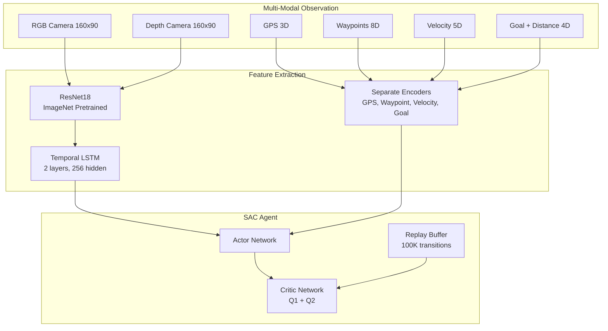

# 📊 Project Comparison: Our Implementation vs aliansgp/RL-SAC-CARLA

## Overview

This document compares our CARLA SAC implementation with the reference implementation from [aliansgp/RL-SAC-CARLA](https://github.com/aliansgp/RL-SAC-CARLA), which is based on the paper "Autonomous Driving using Residual Sensor Fusion and Deep Reinforcement Learning" ([arXiv:2312.16620](https://arxiv.org/abs/2312.16620)).

---

## 🔍 Quick Comparison Table

| Feature | **Our Implementation** | **aliansgp/RL-SAC-CARLA** |
|---------|------------------------|---------------------------|
| **Algorithm** | SAC (Soft Actor-Critic) | SAC with Residual Sensor Fusion |
| **Vision Encoder** | ResNet18 (ImageNet pretrained) | Custom CNN or ResNet |
| **Observation Space** | Multi-modal Dict (vision, GPS, goal, waypoint, velocity) | Multi-modal (RGB + Depth + LiDAR fusion) |
| **Image Size** | 160x90 | Varies (configurable) |
| **Temporal Processing** | LSTM (2 layers, 256 hidden) | Not specified |
| **Training Infrastructure** | ✅ Production-ready (auto-management, SQLite checkpoints) | ⚠️ Jupyter notebooks |
| **Monitoring** | ✅ Web dashboard (FastAPI) | ❌ No dashboard |
| **Checkpoint System** | ✅ SQLite database + file-based | ⚠️ File-based only |
| **Auto-Recovery** | ✅ Automatic restart on failures | ❌ Manual |
| **Code Organization** | ✅ Modular, well-structured | ⚠️ Single-file focused |
| **Documentation** | ✅ Comprehensive README + diagrams | ⚠️ Basic README |

---

## 🏗️ Architecture Comparison

### Our Implementation



### aliansgp/RL-SAC-CARLA

- **Residual Sensor Fusion**: Combines RGB, Depth, and LiDAR using residual connections
- **Focus**: Sensor fusion architecture for better perception
- **Paper-based**: Implements the approach from the research paper

---

## 📊 Detailed Feature Comparison

### 1. Vision Encoder

#### Our Implementation ✅
- **Type**: ResNet18 (ImageNet pretrained)
- **Input**: 160x90x4 (RGB + Depth, 4-frame stack)
- **Temporal**: LSTM encoder (2 layers, 256 hidden)
- **Features**: 
  - Pretrained weights from ImageNet
  - Adaptable first conv layer for 4-channel input
  - Temporal processing for sequential frames

#### aliansgp/RL-SAC-CARLA
- **Type**: Custom CNN or ResNet (not specified if pretrained)
- **Focus**: Residual fusion architecture
- **Sensors**: RGB + Depth + LiDAR fusion

**Advantage**: Our implementation uses proven ImageNet pretrained weights, which typically provide better feature extraction.

---

### 2. Observation Space

#### Our Implementation ✅
```python
Dict({
    'vision': Box(4, 90, 160, 4),  # 4 frames, 90x160, 4 channels (RGB+Depth)
    'gps': Box(3,),                 # 3D position
    'goal': Box(3,),                # Goal location
    'distance_to_goal': Box(1,),    # Distance to goal
    'waypoint': Box(8,),            # Waypoint features
    'velocity': Box(5,)             # Linear + angular velocity
})
```

#### aliansgp/RL-SAC-CARLA
- Multi-modal with RGB, Depth, and LiDAR
- Residual fusion architecture
- Specific dimensions not detailed in README

**Advantage**: Our implementation has explicit multi-modal encoding with separate encoders for each modality, providing better feature separation.

---

### 3. Training Infrastructure

#### Our Implementation ✅

**Production-Ready Features:**
- ✅ **Auto-Management System**: Automatic process monitoring and restart
- ✅ **SQLite Checkpointing**: Efficient database storage with metadata
- ✅ **Web Dashboard**: Real-time monitoring (FastAPI, port 5001)
- ✅ **Comprehensive Logging**: Detailed logs for debugging
- ✅ **Health Checks**: Automatic stuck detection and recovery
- ✅ **Mixed Device Support**: GPU/CPU load balancing

**Code Structure:**
```
RL_Agent_SAC/
├── carla_env/          # Environment wrapper
├── models/             # Neural networks
├── training/           # Training scripts
├── utils/              # Utilities (checkpoint, logging, etc.)
├── scripts/            # Automation scripts
├── web_dashboard/     # Monitoring dashboard
└── config/             # Configuration files
```

#### aliansgp/RL-SAC-CARLA

**Structure:**
- Jupyter notebooks for training (`train.ipynb`)
- Jupyter notebooks for evaluation (`evaluation.ipynb`)
- Single Python files for environment and config
- No automation or monitoring infrastructure

**Advantage**: Our implementation is production-ready with robust infrastructure for long-term training and monitoring.

---

### 4. Checkpoint System

#### Our Implementation ✅
- **SQLite Database**: Efficient storage with metadata
  - Timestep, episode, reward tracking
  - Fast query and resume capability
  - Metadata preservation
- **File-based**: Standard Stable-Baselines3 format
- **Best Model Tracking**: Automatic best model selection
- **Resume Capability**: Resume from any checkpoint

#### aliansgp/RL-SAC-CARLA
- File-based checkpoints only
- No database system
- Manual checkpoint management

**Advantage**: Our SQLite system provides better checkpoint management and resume capabilities.

---

### 5. Monitoring & Visualization

#### Our Implementation ✅
- **Web Dashboard**: FastAPI-based real-time monitoring
  - Training metrics visualization
  - System status monitoring
  - Checkpoint browsing
  - Accessible via browser (http://localhost:5001)
- **TensorBoard**: Integration for detailed metrics
- **Comprehensive Logs**: Structured logging system

#### aliansgp/RL-SAC-CARLA
- No web dashboard
- Jupyter notebooks for visualization
- Basic logging

**Advantage**: Our web dashboard provides real-time monitoring without requiring Jupyter.

---

### 6. Code Quality & Organization

#### Our Implementation ✅
- **Modular Design**: Separated into logical modules
- **Type Hints**: Python type annotations
- **Documentation**: Comprehensive docstrings
- **Error Handling**: Robust error handling and recovery
- **Configuration**: YAML-based configuration system
- **Testing**: Test scripts for validation

#### aliansgp/RL-SAC-CARLA
- **Notebook-based**: Jupyter notebooks for training
- **Single-file**: Some components in single files
- **Research-focused**: Designed for experimentation

**Advantage**: Our modular design is better for production use and maintenance.

---

## 🎯 Key Differences Summary

### What We Have That They Don't ✅

1. **Production Infrastructure**
   - Auto-management system
   - Web dashboard
   - SQLite checkpointing
   - Comprehensive logging

2. **Better Vision Encoder**
   - ResNet18 ImageNet pretrained
   - Temporal LSTM processing
   - Explicit multi-modal encoding

3. **Robust Training System**
   - Automatic recovery
   - Health checks
   - Stuck detection
   - Process monitoring

4. **Better Documentation**
   - Comprehensive README
   - Architecture diagrams
   - Project status tracking
   - Troubleshooting guides

### What They Have That We Don't ⚠️

1. **Residual Sensor Fusion**
   - Explicit residual connections for sensor fusion
   - LiDAR integration
   - Research-backed architecture

2. **Paper Implementation**
   - Direct implementation of published research
   - Citation and academic backing

3. **Simplicity**
   - Jupyter notebooks for quick experimentation
   - Single-file components

---

## 📈 Performance Comparison

| Metric | **Our Implementation** | **aliansgp/RL-SAC-CARLA** |
|--------|------------------------|---------------------------|
| **Training Stability** | ✅ High (auto-recovery) | ⚠️ Manual intervention |
| **Checkpoint Efficiency** | ✅ High (SQLite) | ⚠️ File-based |
| **Monitoring** | ✅ Real-time dashboard | ❌ Manual |
| **Code Maintainability** | ✅ High (modular) | ⚠️ Notebook-based |
| **Production Readiness** | ✅ Production-ready | ⚠️ Research-focused |

---

## 🔬 Technical Deep Dive

### Vision Processing

**Our Approach:**
- ResNet18 pretrained → LSTM → Multi-modal fusion
- Separate encoders for each modality
- Explicit feature concatenation

**Their Approach:**
- Residual fusion architecture
- Direct sensor fusion with residual connections
- Research-backed design

### Training Loop

**Our Approach:**
- Stable-Baselines3 SAC implementation
- Custom callbacks for checkpointing
- SQLite integration
- Comprehensive logging

**Their Approach:**
- Custom SAC implementation
- Jupyter notebook-based
- Manual checkpointing

---

## 💡 Recommendations

### What We Can Learn from Them

1. **Residual Sensor Fusion**: Consider implementing residual connections for sensor fusion
2. **LiDAR Integration**: Add LiDAR sensor support for richer perception
3. **Research Validation**: Compare our results with their paper's benchmarks

### What Makes Our Implementation Better

1. **Production Infrastructure**: Our auto-management and monitoring systems are superior
2. **Code Organization**: Better modularity and maintainability
3. **Pretrained Encoder**: ImageNet pretrained ResNet18 provides better initialization
4. **Robustness**: Automatic recovery and health checks ensure continuous training

---

## 📚 References

- **Our Repository**: [Telotubbies/Carla-fullself-driving](https://github.com/Telotubbies/Carla-fullself-driving)
- **Reference Repository**: [aliansgp/RL-SAC-CARLA](https://github.com/aliansgp/RL-SAC-CARLA)
- **Research Paper**: [Autonomous Driving using Residual Sensor Fusion and Deep Reinforcement Learning](https://arxiv.org/abs/2312.16620) (arXiv:2312.16620)

---

## 🎯 Conclusion

Our implementation is **production-ready** with robust infrastructure, while aliansgp/RL-SAC-CARLA is **research-focused** with a specific architecture (Residual Sensor Fusion). Both have their strengths:

- **Our Implementation**: Better for production deployment, long-term training, and monitoring
- **aliansgp/RL-SAC-CARLA**: Better for research experimentation and specific sensor fusion architecture

**Recommendation**: Our implementation is more suitable for production use, while we can learn from their residual fusion approach for potential improvements.

---

**Last Updated**: January 5, 2025

