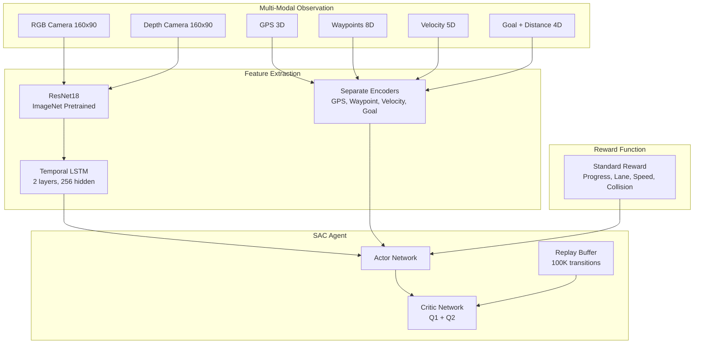

# 📊 Project Comparison: Our Implementation vs Reference Works

## Overview

This document compares our CARLA SAC implementation with:
1. **[aliansgp/RL-SAC-CARLA](https://github.com/aliansgp/RL-SAC-CARLA)**: Residual Sensor Fusion approach ([arXiv:2312.16620](https://arxiv.org/abs/2312.16620))
2. **[MDPI Electronics Paper](https://www.mdpi.com/2079-9292/14/22/4446)**: Predictive Risk-Aware RL with Safety Potential Function

---

## 🔍 Three-Way Comparison Table

| Feature | **Our Implementation** | **aliansgp/RL-SAC-CARLA** | **MDPI Paper (Safety Potential)** |
|---------|------------------------|---------------------------|-----------------------------------|
| **Algorithm** | SAC (Soft Actor-Critic) | SAC with Residual Sensor Fusion | Risk-Aware SAC with Safety Potential |
| **Vision Encoder** | ResNet18 (ImageNet pretrained) | Custom CNN or ResNet | Not specified |
| **Safety Approach** | Collision penalty in reward | Standard reward shaping | **Safety Potential Function** |
| **Risk Assessment** | Implicit (collision penalty) | Implicit | **Explicit predictive risk** |
| **Observation Space** | Multi-modal Dict (vision, GPS, goal, waypoint, velocity) | Multi-modal (RGB + Depth + LiDAR) | Not detailed |
| **Training Infrastructure** | ✅ Production-ready | ⚠️ Jupyter notebooks | ⚠️ Research-focused |
| **Monitoring** | ✅ Web dashboard | ❌ No dashboard | ❌ Not mentioned |
| **Key Innovation** | Production infrastructure | Residual sensor fusion | **Safety-aware learning** |

---

## 🏗️ Architecture Comparison

### Our Implementation



### aliansgp/RL-SAC-CARLA

- **Residual Sensor Fusion**: Combines RGB, Depth, and LiDAR using residual connections
- **Focus**: Sensor fusion architecture for better perception
- **Paper-based**: Implements the approach from the research paper

### MDPI Paper (Safety Potential)

- **Safety Potential Function**: Predictive risk assessment
- **Risk-Aware Learning**: Explicit safety consideration in RL
- **Performance**: Better than distance-based or TTC-based rewards
- **Focus**: Safety-first autonomous driving

---

## 📊 Detailed Feature Comparison

### 1. Safety & Risk Management

#### Our Implementation ⚠️
- **Approach**: Implicit safety through collision penalty (-20.0)
- **Risk Assessment**: Reactive (after collision occurs)
- **Safety Features**:
  - Collision detection
  - Off-lane penalty
  - Speed limits
- **Limitation**: No predictive risk assessment

#### aliansgp/RL-SAC-CARLA ⚠️
- **Approach**: Standard reward shaping
- **Risk Assessment**: Implicit
- **Focus**: Perception improvement through sensor fusion

#### MDPI Paper (Safety Potential) ✅
- **Approach**: **Predictive Risk-Aware RL**
- **Safety Potential Function**: Explicit risk prediction
- **Advantages**:
  - Proactive risk avoidance (not reactive)
  - Better performance than distance/TTC-based rewards
  - Safety-first learning paradigm
- **Key Innovation**: Safety potential function for risk assessment

**Recommendation**: **Implement Safety Potential Function** from MDPI paper for better safety.

---

### 2. Vision Encoder

#### Our Implementation ✅
- **Type**: ResNet18 (ImageNet pretrained)
- **Input**: 160x90x4 (RGB + Depth, 4-frame stack)
- **Temporal**: LSTM encoder (2 layers, 256 hidden)
- **Features**: 
  - Pretrained weights from ImageNet
  - Adaptable first conv layer for 4-channel input
  - Temporal processing for sequential frames

#### aliansgp/RL-SAC-CARLA
- **Type**: Custom CNN or ResNet (not specified if pretrained)
- **Focus**: Residual fusion architecture
- **Sensors**: RGB + Depth + LiDAR fusion

#### MDPI Paper
- **Not Detailed**: Vision encoder specifics not mentioned in abstract

**Advantage**: Our implementation uses proven ImageNet pretrained weights.

---

### 3. Observation Space

#### Our Implementation ✅
```python
Dict({
    'vision': Box(4, 90, 160, 4),  # 4 frames, 90x160, 4 channels (RGB+Depth)
    'gps': Box(3,),                 # 3D position
    'goal': Box(3,),                # Goal location
    'distance_to_goal': Box(1,),    # Distance to goal
    'waypoint': Box(8,),            # Waypoint features
    'velocity': Box(5,)             # Linear + angular velocity
})
```

#### aliansgp/RL-SAC-CARLA
- Multi-modal with RGB, Depth, and LiDAR
- Residual fusion architecture
- Specific dimensions not detailed

#### MDPI Paper
- Not detailed in abstract
- Focus on safety potential, not observation space details

**Advantage**: Our implementation has explicit multi-modal encoding with separate encoders.

---

### 4. Training Infrastructure

#### Our Implementation ✅

**Production-Ready Features:**
- ✅ **Auto-Management System**: Automatic process monitoring and restart
- ✅ **SQLite Checkpointing**: Efficient database storage with metadata
- ✅ **Web Dashboard**: Real-time monitoring (FastAPI, port 5001)
- ✅ **Comprehensive Logging**: Detailed logs for debugging
- ✅ **Health Checks**: Automatic stuck detection and recovery
- ✅ **Mixed Device Support**: GPU/CPU load balancing

#### aliansgp/RL-SAC-CARLA
- Jupyter notebooks for training
- No automation or monitoring infrastructure

#### MDPI Paper
- Research-focused implementation
- No production infrastructure mentioned

**Advantage**: Our implementation is production-ready with robust infrastructure.

---

### 5. Reward Function

#### Our Implementation
```yaml
rewards:
  # Positive rewards
  lane_center_reward: 5.0
  speed_reward: 2.0
  progress_reward: 2.0
  goal_reached_reward: 500.0
  
  # Penalties
  collision_penalty: -20.0
  off_lane_penalty: -2.0
```

**Approach**: Standard reward shaping with collision penalty

#### MDPI Paper (Safety Potential) ✅
- **Safety Potential Function**: Predictive risk assessment
- **Performance**: Better than distance-based or TTC-based rewards
- **Approach**: Risk-aware reward shaping

**Key Innovation**: Safety potential function provides proactive risk assessment

**Recommendation**: **Adopt Safety Potential Function** for better safety performance.

---

## 🎯 What to Adopt from Each Approach

### From MDPI Paper (Safety Potential) - **HIGH PRIORITY** ✅

**Why**: Safety is critical for autonomous driving

**What to Implement:**
1. **Safety Potential Function**
   - Predictive risk assessment
   - Proactive safety (not reactive)
   - Better than collision penalties alone

2. **Risk-Aware Reward Shaping**
   - Integrate safety potential into reward function
   - Balance between performance and safety

**Implementation Plan:**
```python
# Add to carla_rl_env.py
def compute_safety_potential(self, state, action):
    """
    Compute safety potential function for predictive risk assessment
    Based on: MDPI Electronics 14/22/4446
    """
    # Predict future risk based on current state and action
    # Return safety potential value
    pass

def compute_reward(self, ...):
    # Existing rewards
    reward = progress_reward + lane_reward + ...
    
    # Add safety potential component
    safety_potential = self.compute_safety_potential(state, action)
    reward += safety_potential * safety_weight
    
    return reward
```

---

### From aliansgp/RL-SAC-CARLA - **MEDIUM PRIORITY** ⚠️

**Why**: Better sensor fusion could improve perception

**What to Implement:**
1. **Residual Sensor Fusion**
   - Add LiDAR sensor support
   - Implement residual connections for sensor fusion
   - Combine RGB + Depth + LiDAR

2. **LiDAR Integration**
   - Add LiDAR sensor to observation space
   - Process LiDAR point clouds
   - Fuse with vision features

**Implementation Plan:**
```python
# Add LiDAR sensor
# Modify vision_encoder.py to support residual fusion
# Combine RGB, Depth, and LiDAR features with residual connections
```

**Note**: This requires significant architecture changes but could improve perception.

---

### Keep from Our Implementation ✅

**What to Keep:**
1. ✅ **Production Infrastructure**: Auto-management, dashboard, SQLite
2. ✅ **ResNet18 Pretrained**: Proven ImageNet weights
3. ✅ **Temporal LSTM**: Sequential frame processing
4. ✅ **Modular Design**: Maintainable code structure
5. ✅ **Multi-Modal Encoding**: Separate encoders for each modality

---

## 📈 Recommended Implementation Priority

### Phase 1: Safety Potential Function (HIGH PRIORITY) 🚨

**Why First:**
- Safety is critical for autonomous driving
- MDPI paper shows better performance
- Relatively straightforward to implement
- High impact on safety

**Implementation Steps:**
1. Read MDPI paper in detail
2. Implement Safety Potential Function
3. Integrate into reward function
4. Test and validate safety improvements

**Expected Benefits:**
- Proactive risk avoidance
- Better safety performance
- Reduced collisions
- More reliable autonomous driving

---

### Phase 2: Residual Sensor Fusion (MEDIUM PRIORITY) ⚠️

**Why Second:**
- Could improve perception
- Requires significant architecture changes
- Need to add LiDAR sensor support
- More complex implementation

**Implementation Steps:**
1. Add LiDAR sensor to CARLA environment
2. Implement LiDAR processing (point cloud → features)
3. Modify vision encoder for residual fusion
4. Test perception improvements

**Expected Benefits:**
- Better perception through sensor fusion
- More robust to sensor failures
- Richer environmental understanding

---

### Phase 3: Keep Our Infrastructure ✅

**Why Keep:**
- Production-ready infrastructure
- Proven to work well
- Better than research-focused approaches
- Essential for long-term training

---

## 💡 Final Recommendations

### Immediate Action (This Week)

1. **Implement Safety Potential Function** from MDPI paper
   - Read paper: https://www.mdpi.com/2079-9292/14/22/4446
   - Add safety potential computation to `carla_rl_env.py`
   - Integrate into reward function
   - Test safety improvements

### Short Term (1-2 Weeks)

2. **Consider Residual Sensor Fusion** from aliansgp
   - Evaluate if LiDAR adds value
   - Plan architecture changes
   - Implement if beneficial

### Long Term (1-2 Months)

3. **Hybrid Approach**
   - Combine Safety Potential (MDPI) + Residual Fusion (aliansgp)
   - Keep our production infrastructure
   - Best of all three approaches

---

## 📚 References

- **Our Repository**: [Telotubbies/Carla-fullself-driving](https://github.com/Telotubbies/Carla-fullself-driving)
- **aliansgp/RL-SAC-CARLA**: [GitHub](https://github.com/aliansgp/RL-SAC-CARLA)
- **Residual Fusion Paper**: [arXiv:2312.16620](https://arxiv.org/abs/2312.16620)
- **Safety Potential Paper**: [MDPI Electronics 14/22/4446](https://www.mdpi.com/2079-9292/14/22/4446)

---

## 🎯 Conclusion

**Best Approach: Hybrid Implementation**

1. **Adopt Safety Potential Function** (MDPI) - **HIGH PRIORITY**
   - Critical for safety
   - Proven better performance
   - Relatively easy to implement

2. **Consider Residual Sensor Fusion** (aliansgp) - **MEDIUM PRIORITY**
   - Could improve perception
   - Requires more work
   - Evaluate benefit vs. effort

3. **Keep Our Infrastructure** - **ESSENTIAL**
   - Production-ready
   - Proven reliability
   - Essential for long-term training

**Recommended Priority:**
1. 🚨 **Safety Potential Function** (MDPI) - Implement first
2. ⚠️ **Residual Sensor Fusion** (aliansgp) - Evaluate and implement if beneficial
3. ✅ **Our Infrastructure** - Keep and maintain

---

**Last Updated**: January 5, 2025
