# 🗺️ CARLA 0.9.16 - Complete Project Architecture Diagram

## 📊 Overall Project Architecture (Block Diagram)

```mermaid
flowchart TB
    subgraph BLOCK1["┌─────────────────────────────────────────────────┐<br/>│  CARLA SIMULATOR CORE (Unreal Engine 4)  │<br/>└─────────────────────────────────────────────────┘"]
        UE4["Unreal Engine 4<br/>CarlaUE4"]
        SERVER["CARLA Server<br/>Port 2000"]
        WORLD["World Manager<br/>Maps & Actors"]
        PHYSICS["Physics Engine<br/>Vehicle Dynamics"]
    end
    
    subgraph BLOCK2["┌─────────────────────────────────────────────────┐<br/>│  PYTHON API LAYER                        │<br/>└─────────────────────────────────────────────────┘"]
        CLIENT["Python Client<br/>carla.Client"]
        ACTORS["Actor Management<br/>Vehicles, Sensors"]
        SENSORS["Sensor Suite<br/>RGB, Depth, GPS, LiDAR"]
        MAPS["Map & Navigation<br/>Waypoints, Routes"]
    end
    
    subgraph BLOCK3["┌─────────────────────────────────────────────────┐<br/>│  RL AGENT SAC SYSTEM                     │<br/>└─────────────────────────────────────────────────┘"]
        ENV["CarlaRLEnv<br/>Gym Environment"]
        POLICY["SAC Policy<br/>Actor-Critic Network"]
        VISION["Vision Encoder<br/>ResNet18 Pretrained"]
        TRAIN["Training Loop<br/>train_sac.py"]
        BUFFER["Replay Buffer<br/>100K Transitions"]
        CHECKPOINT["Checkpoint Manager<br/>SQLite Database<br/>training_checkpoints.db"]
    end
    
    subgraph BLOCK4["┌─────────────────────────────────────────────────┐<br/>│  AUTO-MANAGEMENT SYSTEM                  │<br/>└─────────────────────────────────────────────────┘"]
        AUTO["Auto Manager<br/>auto_manage.py"]
        MONITOR["Process Monitor<br/>Health Checks"]
        RESTART["Auto Restart<br/>Failure Recovery"]
        DASHBOARD["Web Dashboard<br/>Port 5001"]
    end
    
    subgraph BLOCK5["┌─────────────────────────────────────────────────┐<br/>│  CO-SIMULATION TOOLS                     │<br/>└─────────────────────────────────────────────────┘"]
        SUMO["SUMO Integration<br/>Traffic Simulation"]
        VISSIM["PTV-Vissim<br/>Traffic Analysis"]
        CHRONO["Chrono<br/>Vehicle Physics"]
        CARSIM["CarSim<br/>Vehicle Dynamics"]
    end
    
    subgraph BLOCK6["┌─────────────────────────────────────────────────┐<br/>│  SUPPORTING TOOLS                        │<br/>└─────────────────────────────────────────────────┘"]
        UTILS["Utilities<br/>Logging, GPU, Augmentation"]
        CONFIG["Configuration<br/>YAML Files"]
        LOGS["Logging System<br/>Training Logs"]
        WEB["Web Dashboard<br/>React + FastAPI"]
    end
    
    %% Styling
    classDef blockStyle fill:#2d5aa0,stroke:#1a3d7a,stroke-width:3px,color:#fff
    classDef coreStyle fill:#4a90e2,stroke:#2d5aa0,stroke-width:2px,color:#fff
    classDef apiStyle fill:#50c878,stroke:#2d7a4a,stroke-width:2px,color:#fff
    classDef rlStyle fill:#e24a4a,stroke:#7a1a1a,stroke-width:2px,color:#fff
    classDef autoStyle fill:#e2a04a,stroke:#7a4a1a,stroke-width:2px,color:#fff
    classDef coStyle fill:#9b4ae2,stroke:#4a1a7a,stroke-width:2px,color:#fff
    classDef utilStyle fill:#4ae2a0,stroke:#1a7a4a,stroke-width:2px,color:#fff
    
    class BLOCK1,UE4,SERVER,WORLD,PHYSICS blockStyle,coreStyle
    class BLOCK2,CLIENT,ACTORS,SENSORS,MAPS blockStyle,apiStyle
    class BLOCK3,ENV,POLICY,VISION,TRAIN,BUFFER,CHECKPOINT blockStyle,rlStyle
    class BLOCK4,AUTO,MONITOR,RESTART,DASHBOARD blockStyle,autoStyle
    class BLOCK5,SUMO,VISSIM,CHRONO,CARSIM blockStyle,coStyle
    class BLOCK6,UTILS,CONFIG,LOGS,WEB blockStyle,utilStyle
    
    %% Connections
    UE4 --> SERVER
    SERVER --> WORLD
    WORLD --> PHYSICS
    
    CLIENT --> SERVER
    CLIENT --> ACTORS
    CLIENT --> SENSORS
    CLIENT --> MAPS
    
    ENV --> CLIENT
    ENV --> SENSORS
    ENV --> MAPS
    POLICY --> VISION
    TRAIN --> ENV
    TRAIN --> POLICY
    TRAIN --> BUFFER
    TRAIN --> CHECKPOINT
    
    AUTO --> SERVER
    AUTO --> TRAIN
    AUTO --> DASHBOARD
    MONITOR --> AUTO
    RESTART --> AUTO
    
    SUMO --> SERVER
    VISSIM --> SERVER
    CHRONO --> PHYSICS
    CARSIM --> PHYSICS
    
    TRAIN --> UTILS
    TRAIN --> CONFIG
    TRAIN --> LOGS
    DASHBOARD --> WEB
    CHECKPOINT --> DASHBOARD
```

## 💾 Database Architecture

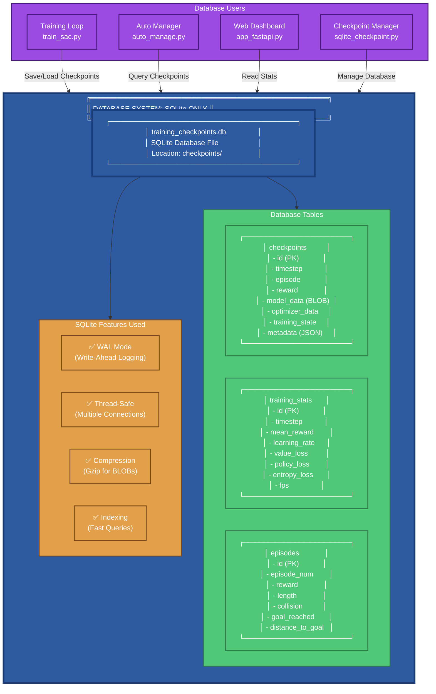

**Note:** โปรเจกต์นี้ใช้ **SQLite เท่านั้น** ไม่มี PostgreSQL, MySQL, MongoDB หรือ database อื่นๆ

## 📦 Simplified Block Diagram

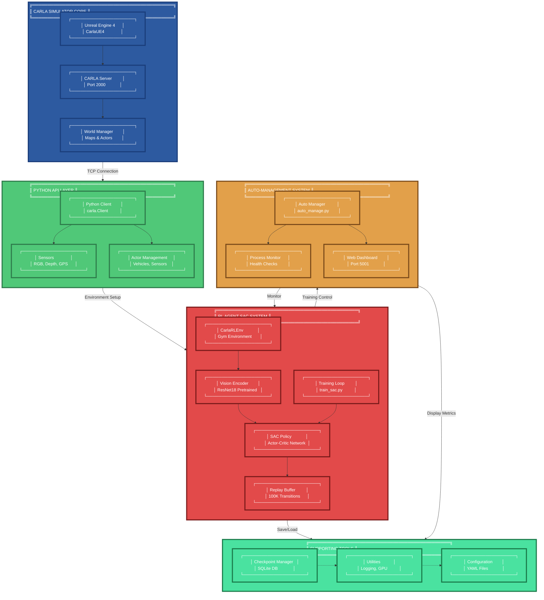

## 🎯 Main System Blocks (Top-Down View)

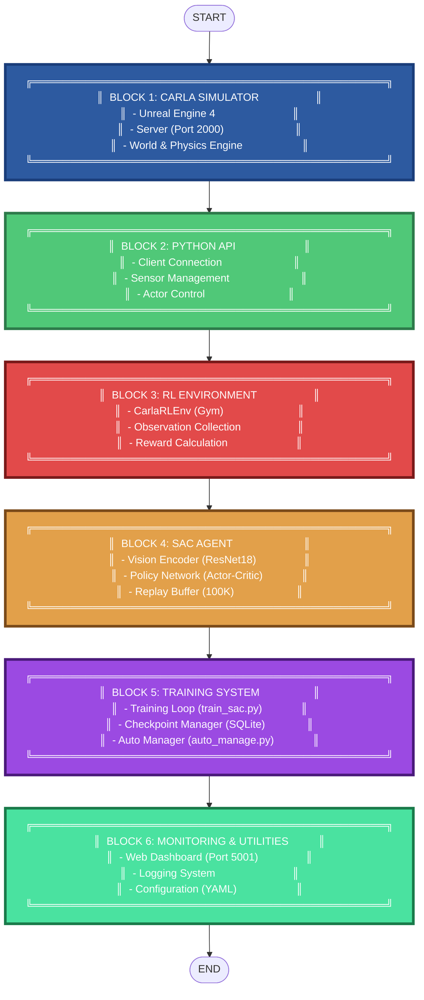

## 🔄 Training Flow Sequence

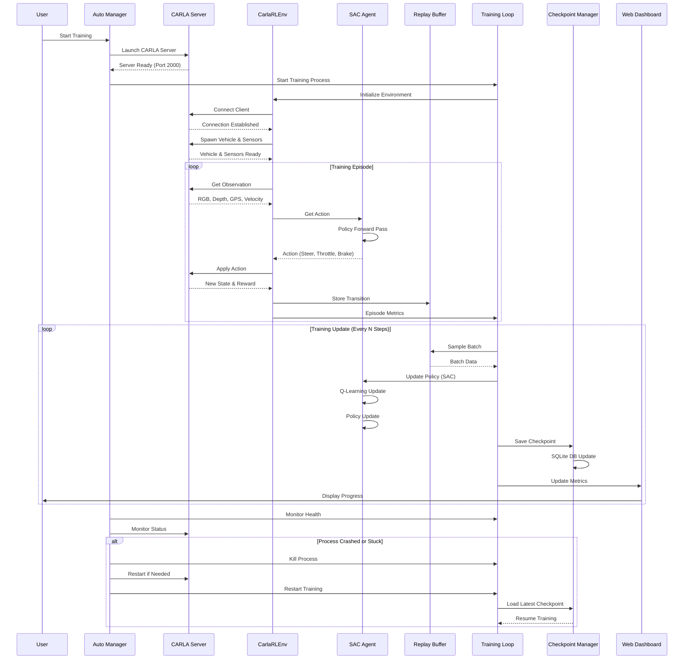

## 🏗️ Component Structure

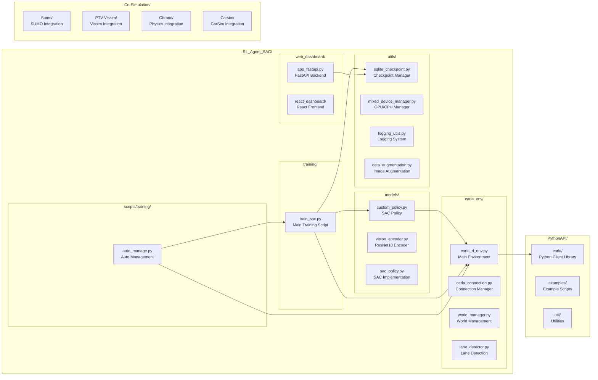

## 🔌 Data Flow Diagram

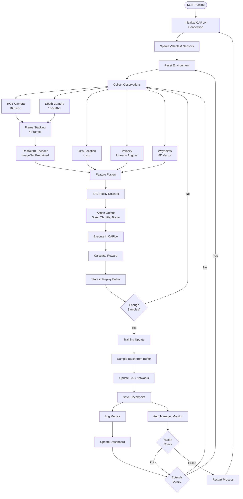

## 🎯 System Interaction Diagram

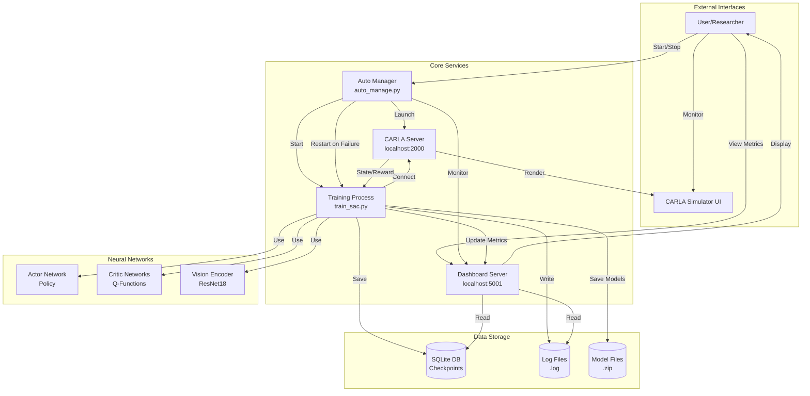

## 📦 Module Dependencies

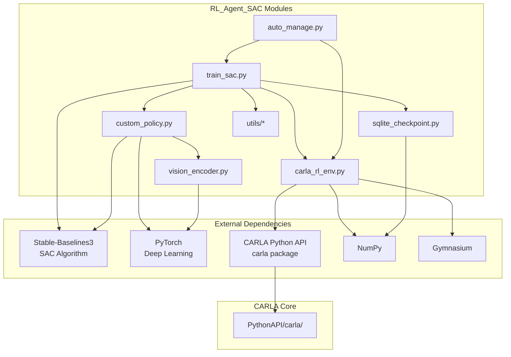

## 🚗 Vehicle Control Flow

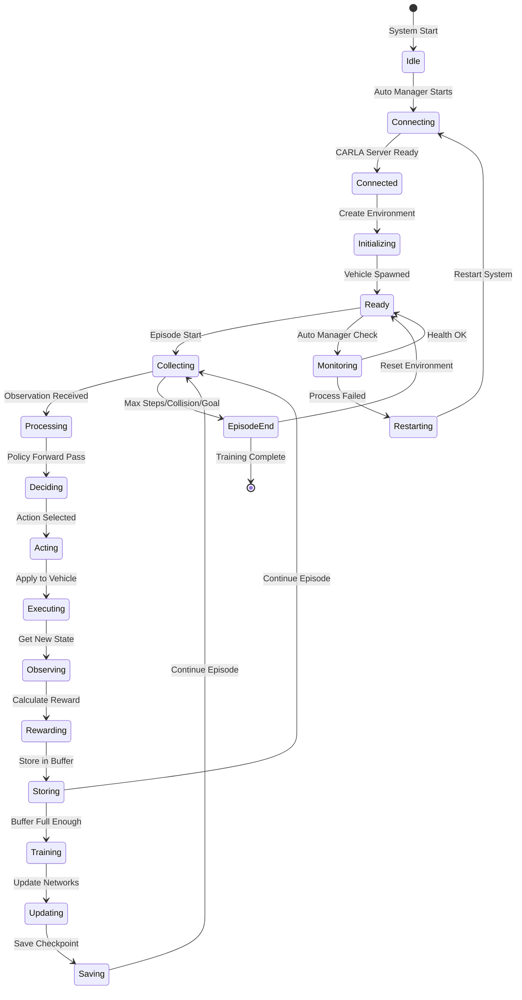

## 📈 Training Metrics Flow

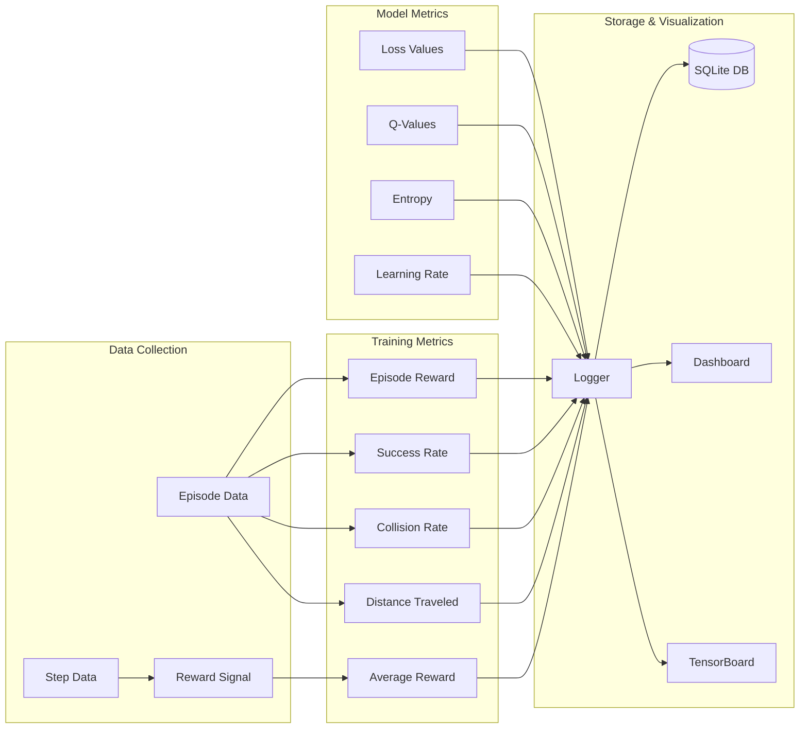

---

## 📝 Diagram Descriptions

### 1. Overall Project Architecture
แสดงโครงสร้างหลักของโปรเจกต์ทั้งหมด รวมถึง:
- CARLA Simulator Core (Unreal Engine)
- Python API Layer
- RL Agent SAC System
- Auto-Management System
- Co-Simulation Tools
- Supporting Tools

### 2. Training Flow Sequence
แสดงลำดับการทำงานของระบบ training ตั้งแต่เริ่มต้นจนถึงการ monitor และ restart

### 3. Component Structure
แสดงโครงสร้างไฟล์และโมดูลต่างๆ ในโปรเจกต์

### 4. Data Flow Diagram
แสดง flow ของข้อมูลตั้งแต่การ collect observations จนถึงการ train และ save checkpoint

### 5. System Interaction Diagram
แสดงการทำงานร่วมกันระหว่าง services ต่างๆ

### 6. Module Dependencies
แสดง dependencies ระหว่าง modules และ external libraries

### 7. Vehicle Control Flow
แสดง state machine ของการควบคุม vehicle

### 8. Training Metrics Flow
แสดง flow ของ metrics ตั้งแต่ collection จนถึง visualization

---

**Generated for CARLA 0.9.16 Project**
**Date:** 2026-01-28
**Repository:** [GitHub](https://github.com/Telotubbies/Carla-fullself-driving)

