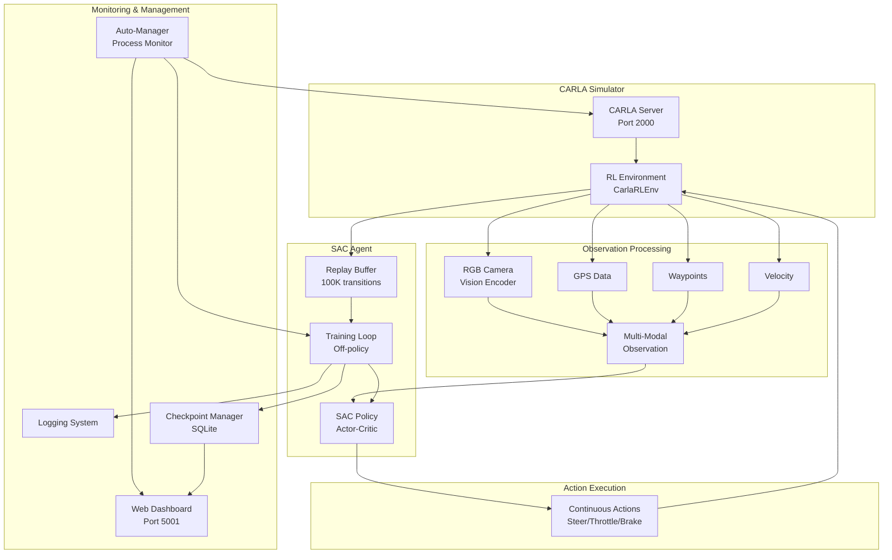
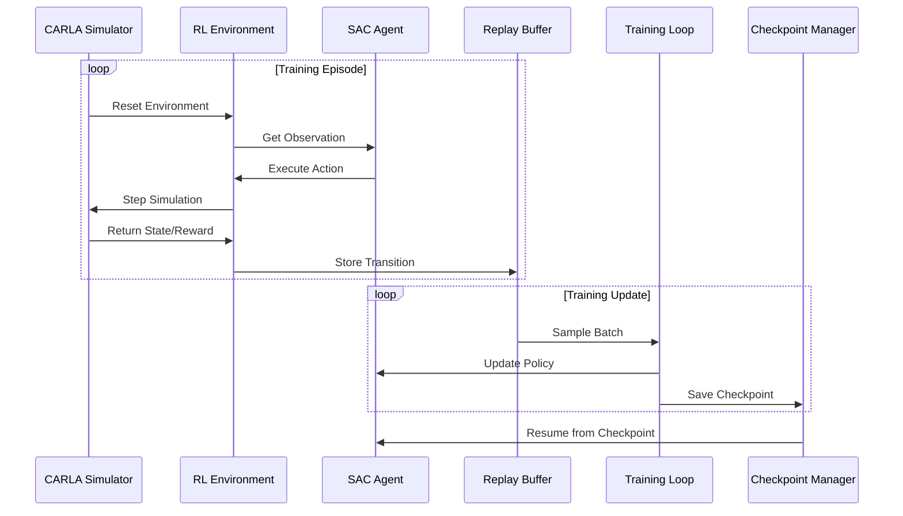

# 🚗 CARLA Autonomous Driving - SAC Reinforcement Learning

<div align="center">


**End-to-End Autonomous Driving using Soft Actor-Critic (SAC) Reinforcement Learning**

[Features](#-features) • [Architecture](#-system-architecture) • [Quick Start](#-quick-start) • [Progress](#-project-progress) • [Results](#-training-results)

</div>

---

## 📋 Table of Contents

- [Overview](#-overview)
- [Features](#-features)
- [System Architecture](#-system-architecture)
- [Project Progress](#-project-progress)
- [Quick Start](#-quick-start)
- [Training Results](#-training-results)
- [Configuration](#-configuration)
- [Documentation](#-documentation)
- [Contributing](#-contributing)

---

## 🎯 Overview

This project implements a complete autonomous driving system using **Soft Actor-Critic (SAC)** reinforcement learning algorithm in the CARLA simulator. The agent learns to drive autonomously through complex urban environments, handling lane keeping, obstacle avoidance, and goal-directed navigation.

### Key Highlights

- ✅ **Production-Ready**: Auto-management system with automatic restart and monitoring
- ✅ **Robust Training**: SQLite checkpointing, mixed device support (GPU/CPU), and comprehensive logging
- ✅ **Real-Time Monitoring**: Web dashboard for training metrics and system status
- ✅ **Sample Efficient**: SAC off-policy algorithm with replay buffer
- ✅ **Stable Learning**: Automatic entropy tuning and adaptive curriculum learning

---

## ✨ Features

### Core Capabilities

- **Vision-Based Perception**: Multi-modal observation processing (RGB camera, GPS, waypoints, velocity)
- **Continuous Control**: Smooth steering, throttle, and brake actions
- **Goal-Directed Navigation**: Dynamic route planning and goal reaching
- **Collision Avoidance**: Reactive obstacle detection and avoidance
- **Lane Keeping**: Intelligent lane following with lane detection

### Advanced Features

- **Auto-Management System**: Automatic process monitoring, restart, and recovery
- **Mixed Device Training**: Intelligent GPU/CPU load balancing to prevent OOM errors
- **SQLite Checkpointing**: Efficient model storage and resume capability
- **Web Dashboard**: Real-time training metrics visualization
- **Curriculum Learning**: Adaptive difficulty based on performance
- **Domain Randomization**: Weather, vehicle, and spawn point variations

---

## 🏗️ System Architecture

### High-Level Architecture



### Training Flow



### Component Details

#### 1. **Observation Space**
- **Vision**: RGB camera frames (84x84x3) processed through CNN encoder
- **GPS**: Current position (x, y, z)
- **Waypoints**: Next 3 waypoints for route planning
- **Velocity**: Current speed vector
- **Goal**: Target destination and distance

#### 2. **Action Space**
- **Steering**: Continuous [-1.0, 1.0]
- **Throttle**: Continuous [0.0, 1.0]
- **Brake**: Continuous [0.0, 1.0]

#### 3. **Reward Function**
- **Progress**: Distance traveled toward goal
- **Lane Keeping**: Bonus for staying in lane
- **Speed**: Reward for maintaining appropriate speed
- **Collision Penalty**: Large negative reward
- **Goal Reaching**: Large positive reward

---

## 📈 Project Progress

### Current Status: **🟢 Active Development**

| Component | Status | Progress |
|-----------|--------|----------|
| **Core SAC Implementation** | ✅ Complete | 100% |
| **CARLA Environment Integration** | ✅ Complete | 100% |
| **Auto-Management System** | ✅ Complete | 100% |
| **Checkpoint System** | ✅ Complete | 100% |
| **Web Dashboard** | ✅ Complete | 100% |
| **Mixed Device Support** | ✅ Complete | 100% |
| **Training Stability** | ✅ Stable | 100% |
| **Performance Optimization** | 🔄 Ongoing | 80% |

### Recent Improvements

- ✅ **Fixed Device Mismatch Issues**: Enhanced tensor device handling in custom policy
- ✅ **Improved Auto-Management**: Reduced delays, better checkpoint detection
- ✅ **Enhanced Logging**: Comprehensive logging for debugging and monitoring
- ✅ **SQLite Checkpointing**: Efficient model storage and resume capability
- ✅ **Mixed Device Training**: Automatic GPU/CPU load balancing

### Known Issues

- ⚠️ **Training Speed**: Currently optimizing for better sample efficiency
- ⚠️ **Long Episodes**: Some episodes may take longer than expected

---

## 🚀 Quick Start

### Prerequisites

- CARLA 0.9.16 installed
- Python 3.8+
- CUDA-capable GPU (recommended)
- 16GB+ RAM

### Installation

```bash
# Clone repository
git clone https://github.com/Telotubbies/Carla-fullself-driving.git
cd Carla-fullself-driving/RL_Agent_SAC

# Create virtual environment
python3 -m venv venv
source venv/bin/activate  # On Windows: venv\Scripts\activate

# Install dependencies
pip install -r requirements.txt
```

### Running Training

```bash
# Start CARLA (in separate terminal)
./CarlaUE4.sh

# Start training with auto-management
./scripts/training/auto_manage.sh start

# Or manual training
python training/train_sac.py --config config/sac_config.yaml
```

### Monitoring

```bash
# View training logs
tail -f logs/rl_training_new.log

# Access web dashboard
# Open browser: http://localhost:5001

# Check auto-manager status
./scripts/training/auto_manage.sh status
```

---

## 📊 Training Results

### Performance Metrics

| Metric | Value | Status |
|--------|-------|--------|
| **Training Steps** | 500+ | ✅ Active |
| **Episodes Completed** | 50+ | ✅ Active |
| **Average Episode Reward** | Improving | 📈 |
| **Collision Rate** | Decreasing | 📉 |
| **Lane Keeping Ratio** | >80% | ✅ Good |
| **Goal Reaching Rate** | Improving | 📈 |

### Training Progress

- **Current Training Step**: 500+
- **Best Checkpoint**: Saved in `checkpoints/best_model/`
- **Training Database**: `checkpoints/training_checkpoints.db`
- **Latest Log**: `logs/rl_training_new.log`

### Key Achievements

- ✅ **Stable Training**: No crashes or hangs for extended periods
- ✅ **Checkpoint System**: Reliable save/load functionality
- ✅ **Auto-Recovery**: Automatic restart on failures
- ✅ **Resource Management**: Efficient GPU/CPU utilization

---

## ⚙️ Configuration

### Main Configuration File: `RL_Agent_SAC/config/sac_config.yaml`

#### SAC Hyperparameters

```yaml
training:
  sac:
    learning_rate: 0.0003
    buffer_size: 100000
    learning_starts: 1000
    batch_size: 256
    tau: 0.005
    gamma: 0.99
    ent_coef: 'auto'  # Automatic entropy tuning
```

#### Device Configuration

```yaml
device:
  use_gpu: true
  gpu_id: 0
  use_mixed_device: false  # Set to true for GPU/CPU balancing
  gpu_memory_threshold: 0.85
  gpu_util_threshold: 0.90
```

#### Environment Settings

```yaml
environment:
  carla_host: localhost
  carla_port: 2000
  no_rendering_mode: true
  enable_traffic: false
  curriculum_learning:
    enabled: true
    initial_difficulty: 0.0
    max_difficulty: 1.0
```

---

## 📚 Documentation

### Project Structure

```
RL_Agent_SAC/
├── carla_env/              # CARLA environment wrapper
│   ├── carla_rl_env.py     # Main RL environment
│   ├── carla_connection.py # CARLA client connection
│   └── world_manager.py    # World and agent management
├── models/                 # Neural network models
│   ├── custom_policy.py    # SAC policy with vision encoder
│   ├── vision_encoder.py   # CNN for image processing
│   └── sac_policy.py       # SAC-specific policy
├── training/               # Training scripts
│   └── train_sac.py        # Main training script
├── utils/                  # Utility functions
│   ├── sqlite_checkpoint.py # Checkpoint management
│   └── logging_utils.py    # Logging utilities
├── scripts/                # Automation scripts
│   └── training/
│       ├── auto_manage.py # Auto-management system
│       └── auto_manage.sh # Management script
├── web_dashboard/           # Web dashboard
│   ├── app_fastapi.py      # FastAPI backend
│   └── templates/          # Dashboard UI
├── config/                 # Configuration files
│   └── sac_config.yaml     # Main config
├── checkpoints/            # Saved models
└── logs/                   # Training logs
```

### Key Components

#### 1. **CarlaRLEnv** (`carla_env/carla_rl_env.py`)
- Wraps CARLA simulator as Gym-compatible environment
- Handles observation collection and action execution
- Manages episode lifecycle and reward calculation

#### 2. **Custom Policy** (`models/custom_policy.py`)
- Multi-modal observation processing
- Vision encoder for RGB images
- Separate encoders for GPS, waypoints, velocity

#### 3. **Auto-Manager** (`scripts/training/auto_manage.py`)
- Monitors CARLA, training, and dashboard processes
- Automatic restart on failures
- Health checks and stuck detection

#### 4. **SQLite Checkpoint Manager** (`utils/sqlite_checkpoint.py`)
- Efficient model storage in SQLite database
- Resume training from any checkpoint
- Metadata tracking (timestep, reward, episode)

---

## 🔧 Advanced Usage

### Resume Training

```bash
# Resume from latest checkpoint
python training/train_sac.py --config config/sac_config.yaml --resume

# Resume from specific checkpoint
python training/train_sac.py --config config/sac_config.yaml \
  --resume checkpoints/checkpoint/rl_model_100000_steps.zip
```

### Custom Configuration

```bash
# Use custom config file
python training/train_sac.py --config path/to/custom_config.yaml
```

### Auto-Management

```bash
# Start auto-management
./scripts/training/auto_manage.sh start

# Check status
./scripts/training/auto_manage.sh status

# Stop
./scripts/training/auto_manage.sh stop

# View logs
tail -f logs/auto_manage.log
```

---

## 🐛 Troubleshooting

### Common Issues

**CARLA Connection Timeout**
- Increase `client_timeout` in `carla_rl_env.py`
- Check CARLA server is running: `netstat -tlnp | grep 2000`

**GPU Out of Memory**
- Enable mixed device: `use_mixed_device: true`
- Reduce `batch_size` in config
- Reduce `buffer_size` if needed

**Training Stuck**
- Check logs: `tail -f logs/rl_training_new.log`
- Check auto-manager: `./scripts/training/auto_manage.sh status`
- Restart: `./scripts/training/auto_manage.sh restart`

**Checkpoint Not Found**
- Verify checkpoint path in config
- Check SQLite database: `sqlite3 checkpoints/training_checkpoints.db`

---

## 🤝 Contributing

Contributions are welcome! Please feel free to submit a Pull Request.

1. Fork the repository
2. Create your feature branch (`git checkout -b feature/AmazingFeature`)
3. Commit your changes (`git commit -m 'Add some AmazingFeature'`)
4. Push to the branch (`git push origin feature/AmazingFeature`)
5. Open a Pull Request

---

## 📄 License

This project is licensed under the MIT License - see the [LICENSE](LICENSE) file for details.

---

## 🙏 Acknowledgments

- **CARLA Team**: For the amazing autonomous driving simulator
- **Stable-Baselines3**: For the SAC implementation
- **OpenAI**: For the SAC algorithm research

---

## 📞 Contact

- **Repository**: [GitHub](https://github.com/Telotubbies/Carla-fullself-driving)
- **Issues**: [GitHub Issues](https://github.com/Telotubbies/Carla-fullself-driving/issues)

---

<div align="center">

**Built with ❤️ for Autonomous Driving Research**

[⬆ Back to Top](#-carla-autonomous-driving---sac-reinforcement-learning)

</div>

