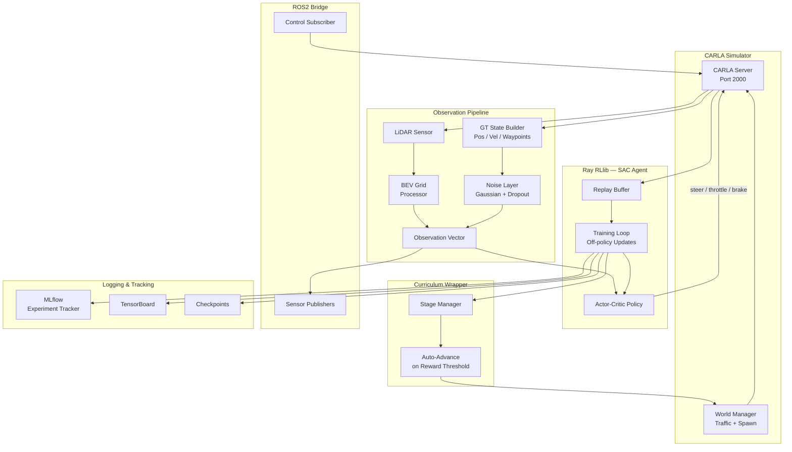

# CARLA SAC ROS2 Training


**End-to-end autonomous driving agent trained with Soft Actor-Critic (SAC) in the CARLA simulator, integrated with ROS2 for real-time sensor streaming and vehicle control.**

---

## Overview

This project provides a complete reinforcement learning pipeline for training autonomous driving agents in CARLA. The agent perceives the environment through a **LiDAR Bird's Eye View (BEV)** grid and optionally a ground-truth state vector, then outputs continuous steering, throttle, and brake commands via SAC.

Key design choices:

- **Ray RLlib** as the primary training framework (off-policy SAC)
- **Curriculum learning** — difficulty escalates automatically as the agent improves
- **ROS2 bridge** — publishes sensor observations and subscribes to control commands for hardware-in-the-loop or evaluation
- **MLflow** — experiment tracking, parameter logging, and metric dashboards
- **Ground-truth state path** (`train_rllib_gt.py`) for fast iteration without heavy vision processing

---

## Features

- LiDAR BEV grid perception with configurable range, FOV, and resolution
- Ground-truth state observation builder (position, velocity, waypoints, nearby vehicles)
- Sensor noise simulation — position/velocity Gaussian noise, latency, and dropout
- Curriculum wrapper — auto-advances training stages based on episode performance
- Multi-modal observation support (BEV + kinematics + waypoints)
- Comprehensive reward shaping — progress, comfort, collision, lane deviation, speed tracking
- ROS2 integration — sensor topics, control topics, TF2, QoS configuration
- MLflow experiment tracking with per-run parameter and metric logging
- RLlib checkpointing with resume support
- TensorBoard logging
- Evaluation and deployment scripts (`deploy_model.py`, `scripts/evaluate_model.sh`)
- Configurable entirely via YAML — no code changes needed for hyperparameter sweeps

---

## Tech Stack

| Component | Version |
|-----------|---------|
| Python | 3.10+ |
| Ray RLlib | 2.54.1 |
| PyTorch | 2.11.0 |
| CARLA Simulator | 0.9.16 |
| ROS2 | Humble / Iron / Jazzy |
| Stable-Baselines3 | latest |
| MLflow | latest |
| NumPy / OpenCV | latest |

---

## Architecture



---

## Installation

### Prerequisites

- Ubuntu 20.04 / 22.04
- Python 3.10+
- CARLA Simulator 0.9.16
- ROS2 (Humble, Iron, or Jazzy)
- CUDA-capable GPU (recommended)
- 16 GB+ RAM

### 1. Clone Repository

```bash
git clone https://github.com/Telotubbies/Carla-fullself-driving.git
cd Carla-fullself-driving
```

### 2. Set Up Virtual Environment

```bash
python3 -m venv venv
source venv/bin/activate

pip install -r requirements.txt
pip install -e .
```

### 3. Install CARLA

Download CARLA 0.9.16 from the [official release page](https://github.com/carla-simulator/carla/releases/tag/0.9.16) and add the Python API to your path:

```bash
export PYTHONPATH=$PYTHONPATH:/path/to/CARLA_0.9.16/PythonAPI/carla/dist/carla-0.9.16-py3.10-linux-x86_64.egg
```

### 4. Build ROS2 Package (optional)

```bash
cd ros2_ws
colcon build --symlink-install
source install/setup.bash
```

---

## Usage

### Start CARLA

```bash
# In a separate terminal
/path/to/CarlaUE4.sh -RenderOffScreen
```

### Train with Ground-Truth State (recommended for fast iteration)

```bash
python train_rllib_gt.py --config config/gt_state.yaml
```

### Train with Full Pipeline (BEV + perception + guidelines)

```bash
python train_rllib_full.py
```

### Train with Stable-Baselines3 SAC

```bash
python start_rl_training.py
```

### Run Demo (no training)

```bash
python demo_simple_drive.py   # constant throttle smoke test
python demo_autopilot.py      # CARLA built-in autopilot
```

### Evaluate a Checkpoint

```bash
bash scripts/evaluate_model.sh
# or
python deploy_model.py --checkpoint checkpoints/gt/final
```

### Launch ROS2 Bridge

```bash
python scripts/run_ros2_bridge.py
# or via launch file
ros2 launch launch/eval.launch.py
```

### Monitor Training

```bash
# TensorBoard
tensorboard --logdir data/tensorboard

# MLflow UI
mlflow ui --backend-store-uri mlruns/
```

---

## Configuration

All behaviour is controlled by YAML files in `config/`. No source changes are needed for hyperparameter sweeps.

| File | Purpose |
|------|---------|
| `config/gt_state.yaml` | Ground-truth state builder — perception cone, waypoints, BEV grid, noise parameters, reward weights, RViz flags |
| `config/sac_config.yaml` | SAC hyperparameters — learning rate, batch size, replay buffer, gamma, entropy coefficient |
| `config/carla_config.yaml` | CARLA connection, map, episode length, LiDAR/camera/IMU specs, weather, traffic, reward weights |
| `config/ros2_config.yaml` | ROS2 node name, topic names, QoS profiles, TF frames, publish rates |
| `config/training_guidelines.yaml` | Driving guideline scenarios (speed, steering, lane) for reward shaping in the full pipeline |

### Key Parameters (`config/gt_state.yaml`)

```yaml
perception:
  max_range: 50.0       # sensor range in metres
  fov_deg: 120.0        # field of view
  n_vehicles: 5         # max tracked vehicles

noise:
  pos_sigma: 0.1        # position noise (metres)
  vel_sigma: 0.05       # velocity noise (m/s)
  latency_frames: 1     # observation delay frames
  dropout_p: 0.05       # probability of missing detection

bev:
  size: 64              # grid size (pixels)
  resolution: 0.5       # metres per pixel
```

---

## Project Structure

```
carla_sac_ros2_training/
├── src/
│   ├── carla_gym_env/        # Gym-compatible CARLA environment
│   ├── sac_trainer/          # RLlib SAC training entry point
│   ├── ros2_bridge/          # ROS2 sensor/control bridge
│   ├── perception/           # BEV grid processor, Tesla-style perception
│   ├── gt_state/             # Ground-truth state builder
│   ├── env_wrappers/         # Curriculum wrapper, noise injection
│   ├── curriculum/           # Stage definitions and advance logic
│   ├── imitation/            # Imitation learning utilities
│   ├── mlflow_integration/   # MLflow callbacks and logging
│   └── utils/                # Shared utilities
├── config/
│   ├── gt_state.yaml
│   ├── sac_config.yaml
│   ├── carla_config.yaml
│   ├── ros2_config.yaml
│   └── training_guidelines.yaml
├── scripts/                  # Shell and Python helper scripts
├── tests/                    # pytest test suite
├── launch/                   # ROS2 launch files
├── ros2_ws/                  # Colcon ROS2 workspace
├── checkpoints/              # Saved RLlib checkpoints
├── mlruns/                   # MLflow experiment data
├── artifacts/                # Curriculum state, episode recordings
├── logs/                     # Training logs
├── train_rllib_gt.py         # GT-state training entry point
├── train_rllib_full.py       # Full pipeline training entry point
├── start_rl_training.py      # SB3 SAC training entry point
├── deploy_model.py           # Checkpoint deployment / inference
├── demo_simple_drive.py      # Minimal smoke-test demo
├── requirements.txt
└── setup.py
```

---

## Testing

```bash
# Run full test suite
pytest tests/ -v

# Run with coverage
pytest tests/ --cov=src --cov-report=html
```

---

## Deployment

### Inference from Checkpoint

```bash
python deploy_model.py \
  --checkpoint checkpoints/gt/final \
  --config config/gt_state.yaml \
  --host localhost --port 2000
```

### ROS2 Deployment

```bash
# Build and source the ROS2 package
cd ros2_ws && colcon build && source install/setup.bash

# Launch the full evaluation stack
ros2 launch launch/eval.launch.py
```

### Docker (coming soon)

A `Dockerfile` and `docker-compose.yml` for containerised training are planned.

---

## Contributing

Contributions are welcome. Please follow this workflow:

1. Fork the repository
2. Create a feature branch: `git checkout -b feature/your-feature`
3. Commit your changes: `git commit -m 'feat: describe your change'`
4. Push to your fork: `git push origin feature/your-feature`
5. Open a Pull Request against `main`

Please make sure `pytest tests/` passes before submitting.

---

## License

This project is licensed under the [MIT License](LICENSE).

---

## Acknowledgements

- [CARLA Simulator](https://carla.org/) — Unreal Engine-based autonomous driving simulator
- [Ray RLlib](https://docs.ray.io/en/latest/rllib/) — Scalable reinforcement learning library
- [Stable-Baselines3](https://stable-baselines3.readthedocs.io/) — Reliable RL baselines
- [MLflow](https://mlflow.org/) — Open-source ML experiment tracking
