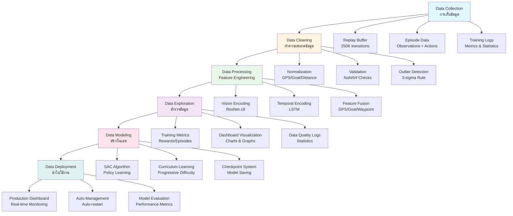
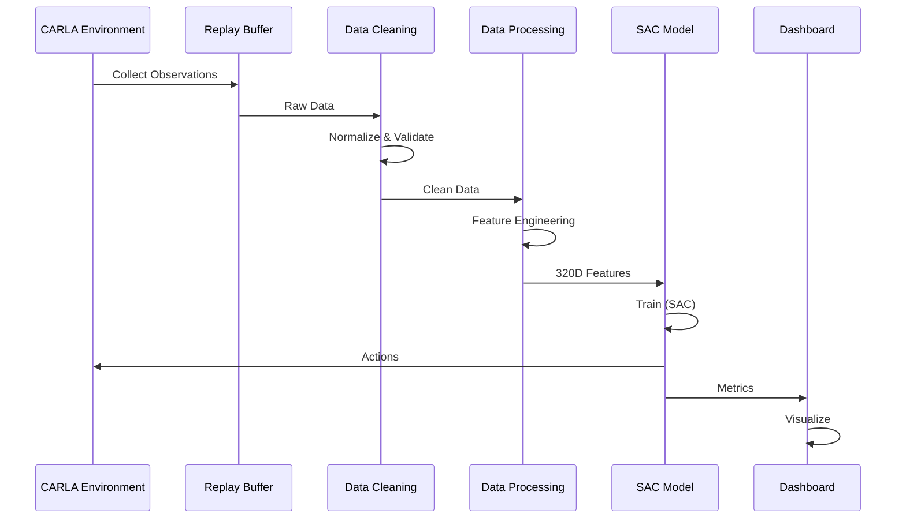

# 📊 Data Pipeline: CARLA RL Agent Training

**Date**: January 26, 2026  
**Status**: ✅ **Complete Pipeline Documentation**

---

## 🎯 Overview

เอกสารนี้อธิบายกระบวนการ Data Pipeline ทั้ง 6 ขั้นตอนสำหรับ CARLA RL Agent Training System ตั้งแต่การเก็บข้อมูลจนถึงการนำไปใช้งานจริง

---

## 📐 Data Pipeline Flow



---

## 1️⃣ Data Collection (การเก็บข้อมูล)

### 📋 กระบวนการเก็บข้อมูล

**วิธีการเก็บข้อมูล:**
- ✅ **Replay Buffer**: เก็บ experiences (observations, actions, rewards) จำนวน 250,000 transitions
- ✅ **Episode Data**: เก็บข้อมูลแต่ละ episode (vision, GPS, goal, waypoint, velocity)
- ✅ **Training Logs**: เก็บ metrics และ statistics ระหว่าง training

**ข้อมูลที่เก็บ:**
```python
# Observation Space
- Vision: 4 stacked frames (90x160x4) - RGB + Depth
- GPS: 3D coordinates (normalized to [-1, 1])
- Goal: 4D (x, y, z, relative_angle) (normalized to [-1, 1])
- Distance to Goal: 1D (normalized to [0, 1])
- Waypoint: 8D (lane information)
- Velocity: 7D (speed, velocity components, yaw, yaw_rate)

# Action Space
- Steering: [-1.0, 1.0]
- Throttle: [0.0, 1.0]
- Brake: [0.0, 1.0]

# Rewards
- Lane center reward
- Speed reward
- Progress reward
- Goal reached reward
- Collision penalty
```

**สถานที่เก็บข้อมูล:**
- 📁 `RL_Agent_SAC/checkpoints/` - Checkpoints และ replay buffer
- 📁 `RL_Agent_SAC/logs/` - Training logs และ metrics
- 📁 `RL_Agent_SAC/checkpoints/training_checkpoints.db` - SQLite database

**ระยะเวลาการเก็บข้อมูล:**
- ✅ **ปัจจุบัน**: เก็บข้อมูลต่อเนื่องระหว่าง training
- ✅ **ขั้นต่ำ**: ควรมีข้อมูลอย่างน้อย 1 เดือนสำหรับการวิเคราะห์
- ✅ **Auto-cleanup**: ระบบจะลบข้อมูลเก่าอัตโนมัติเมื่อ disk space เต็ม

**ปัญหาที่พบในการเก็บข้อมูล:**
- ⚠️ **Disk Space**: Replay buffer files อาจใหญ่ถึง 400GB+
- ✅ **แก้ไข**: ปิดการบันทึก replay buffer ใน checkpoint (`save_replay_buffer=False`)
- ⚠️ **Log Files**: Log files อาจใหญ่มาก (carla.log > 2GB)
- ✅ **แก้ไข**: Auto-cleanup system ลบ log files เก่าอัตโนมัติ

---

## 2️⃣ Data Cleaning (ทำความสะอาดข้อมูล)

### 🧹 กระบวนการทำความสะอาดข้อมูล

**1. Normalization (การปรับค่าข้อมูล)**
```python
# GPS Normalization
gps_normalized = gps / max_range  # [-1, 1]

# Goal Normalization  
goal_normalized = goal / max_range  # [-1, 1]
distance_normalized = distance / max_distance  # [0, 1]
```

**2. Data Validation (การตรวจสอบข้อมูล)**
```python
# NaN/Inf Checks
if np.isnan(obs) or np.isinf(obs):
    return zero_observation  # Return safe default

# Range Validation
if not (-1.0 <= normalized_value <= 1.0):
    return zero_observation  # Invalid range
```

**3. Outlier Detection (การตรวจจับค่าผิดปกติ)**
```python
# 3-sigma Rule
mean = np.mean(values)
std = np.std(values)
outliers = values[np.abs(values - mean) > 3 * std]

# Log outliers but don't reject (for learning)
if outlier_detected:
    logging.warning(f"Outlier detected: {value}")
```

**ปัญหาที่พบ:**
- ⚠️ **NaN/Inf Values**: อาจเกิดจาก CARLA sensor errors
- ✅ **แก้ไข**: Validation checks และ return zero observation
- ⚠️ **Outliers**: GPS/Goal values อาจผิดปกติ
- ✅ **แก้ไข**: Outlier detection และ logging (ไม่ reject เพื่อให้ model เรียนรู้)

**ผลลัพธ์:**
- ✅ **Clean Data**: ข้อมูลที่ผ่าน normalization และ validation
- ✅ **Quality Metrics**: Logged statistics (invalid count, outlier count)
- ✅ **Safe Defaults**: Zero observations สำหรับ invalid data

---

## 3️⃣ Data Processing (Feature Engineering / Data Transformation)

### ⚙️ กระบวนการเตรียมข้อมูลสำหรับโมเดล

**1. Vision Encoding (ResNet-18)**
```python
# Input: 4 frames (90x160x4)
# Output: 512 features per frame
vision_features = ResNet18_encoder(vision_frames)
# Shape: (batch, 4, 512)
```

**2. Temporal Encoding (LSTM)**
```python
# Input: 4 frames × 512 features
# Output: 256 temporal features
temporal_features = LSTM_encoder(vision_features)
# Shape: (batch, 256)
```

**3. Feature Fusion**
```python
# Combine all features
fused_features = concat([
    temporal_features,    # 256D (from LSTM)
    gps_features,         # 16D (normalized)
    goal_features,        # 16D (normalized)
    waypoint_features,    # 16D
    velocity_features     # 16D
])
# Total: 320D
```

**4. Data Augmentation**
```python
# Applied during training
augmentations = [
    'color_jitter',      # Random color adjustments
    'gaussian_noise',    # Add noise
    'motion_blur',       # Simulate motion
    'random_erasing'     # Random masking
]
```

**Feature Engineering Techniques:**
- ✅ **Normalization**: GPS/Goal/Distance → [-1, 1] or [0, 1]
- ✅ **Temporal Stacking**: 4 frames → temporal context
- ✅ **Feature Encoding**: Raw data → learned representations
- ✅ **Data Augmentation**: Increase diversity

**ผลลัพธ์:**
- ✅ **320D Feature Vector**: Ready for SAC policy network
- ✅ **Normalized Values**: Stable training
- ✅ **Temporal Context**: Motion understanding

---

## 4️⃣ Data Exploration (สำรวจข้อมูล / Visualize)

### 📊 กระบวนการสำรวจและแสดงข้อมูล

**1. Training Metrics Visualization**
```python
# Metrics tracked
- Episode reward
- Episode length
- Current step
- Best reward
- Average reward
- Recent average (last 10 episodes)
```

**2. Dashboard Visualization**
- 📈 **Training Chart**: Real-time reward trends
- 📊 **Metrics Card**: Statistics (best, avg, recent)
- 💻 **System Resources**: CPU, Memory, GPU, Disk
- 📝 **Training Logs**: Real-time log display
- ✅ **Checkpoints**: Latest checkpoint info

**3. Data Quality Logs**
```python
# Logged every 1000 steps
- Invalid observation count
- Outlier count
- NaN/Inf count
- Data quality percentage
```

**Visualization Tools:**
- ✅ **React Dashboard**: Real-time web interface
- ✅ **Training Charts**: Chart.js for trends
- ✅ **System Metrics**: Progress bars and gauges
- ✅ **Log Viewer**: Scrollable log display

**ข้อมูลที่แสดง:**
- 📊 **Training Progress**: Current step, target, percentage
- 📈 **Reward Trends**: Episode rewards over time
- 💾 **System Resources**: CPU, Memory, GPU usage
- 📁 **Checkpoints**: Latest checkpoint info
- 📝 **Training Logs**: Real-time log output

---

## 5️⃣ Data Modeling (สร้างโมเดลทำนาย)

### 🤖 กระบวนการสร้างโมเดล

**1. SAC Algorithm (Soft Actor-Critic)**
```python
# Policy Network
Actor: 320D → [512, 256, 128] → Actions
Critic (Q1, Q2): 320D + Actions → Q-values
Value: 320D → State value

# Training
- Off-policy learning
- Replay buffer: 250K transitions
- Batch size: 256
- Learning rate: 0.0003
- Automatic entropy tuning
```

**2. Curriculum Learning**
```python
# Progressive difficulty
initial_difficulty = 0.0
max_difficulty = 1.0
difficulty_increase_rate = 0.002

# Adjusts:
- num_vehicles: 0 → 15
- num_pedestrians: 0 → 10
- enable_traffic: based on difficulty
```

**3. Reward Optimization**
```python
# Reward components
lane_center_reward: 10.0
speed_reward: 4.0
progress_reward: 6.0
goal_reached_reward: 1000.0
collision_penalty: -500.0

# Progressive rewards
reward_scale: increases over time
```

**Model Architecture:**
```
Input (320D features)
    ↓
SAC Policy Network
    ↓
Actions (Steering, Throttle, Brake)
    ↓
CARLA Environment
    ↓
Rewards + Next State
```

**ประสิทธิภาพ:**
- ✅ **Sample Efficiency**: Off-policy learning
- ✅ **Stability**: Double Q-learning, soft updates
- ✅ **Adaptability**: Curriculum learning
- ✅ **Performance**: Best reward tracking

**Checkpoint System:**
- 💾 **Auto-save**: Every 2000 steps
- 🗜️ **Compression**: ZIP_DEFLATED
- 📊 **SQLite**: Metadata storage
- 🔄 **Resume**: Automatic checkpoint loading

---

## 6️⃣ Data Deployment (นำไปใช้งานจริง)

### 🚀 กระบวนการนำไปใช้งาน

**1. Production Dashboard**
```python
# Real-time monitoring
- Training status
- System resources
- Training metrics
- Checkpoint info
- Training logs
```

**2. Auto Management System**
```python
# Auto-restart on failures
- CARLA health check
- Training process monitoring
- Dashboard health check
- Auto-cleanup (disk space)
- Stuck detection (30min threshold)
```

**3. Model Evaluation**
```python
# Performance metrics
- Episode reward trends
- Episode length
- Success rate
- Collision rate
- Goal reached rate
```

**การนำไปใช้งาน:**
- ✅ **Real-time Monitoring**: Dashboard updates every 1 minute
- ✅ **Auto-restart**: System automatically restarts on failures
- ✅ **Checkpoint Management**: Automatic saving and loading
- ✅ **Resource Management**: Auto-cleanup when disk space is low

**การแสดงผลและสื่อสาร:**
- 📊 **Dashboard**: Web-based interface (http://localhost:5001)
- 📈 **Charts**: Real-time training progress
- 📝 **Logs**: Detailed training logs
- 💻 **System Metrics**: CPU, Memory, GPU, Disk usage

**สนับสนุนการตัดสินใจ:**
- ✅ **Training Progress**: Current step vs target
- ✅ **Performance Metrics**: Best reward, average reward
- ✅ **System Health**: Resource usage, errors
- ✅ **Checkpoint Info**: Latest model state

**การทำนายต่อไป:**
- 🔮 **Model Inference**: Use trained model for predictions
- 🎯 **Goal Navigation**: Navigate to target locations
- 🚗 **Autonomous Driving**: Full self-driving capabilities
- 📊 **Performance Tracking**: Monitor model performance

---

## 📊 Pipeline Summary



---

## 📈 Data Pipeline Statistics

| Stage | Data Size | Processing Time | Output |
|-------|-----------|----------------|--------|
| **Collection** | 250K transitions | Real-time | Raw observations |
| **Cleaning** | 250K transitions | <1ms per obs | Normalized data |
| **Processing** | 250K transitions | ~10ms per obs | 320D features |
| **Exploration** | Continuous | Real-time | Visualizations |
| **Modeling** | 250K transitions | ~100ms per batch | Trained model |
| **Deployment** | Continuous | Real-time | Production system |

---

## ✅ Checklist

### Data Collection
- [x] Replay buffer (250K transitions)
- [x] Episode data collection
- [x] Training logs
- [x] Checkpoint system
- [x] Auto-cleanup system

### Data Cleaning
- [x] GPS/Goal normalization
- [x] Distance normalization
- [x] NaN/Inf validation
- [x] Range validation
- [x] Outlier detection

### Data Processing
- [x] Vision encoding (ResNet-18)
- [x] Temporal encoding (LSTM)
- [x] Feature fusion
- [x] Data augmentation

### Data Exploration
- [x] Training metrics
- [x] Dashboard visualization
- [x] Data quality logs
- [x] Real-time charts

### Data Modeling
- [x] SAC algorithm
- [x] Curriculum learning
- [x] Reward optimization
- [x] Checkpoint system

### Data Deployment
- [x] Production dashboard
- [x] Auto management
- [x] Model evaluation
- [x] Real-time monitoring

---

## 🎯 Conclusion

ระบบ CARLA RL Agent มี Data Pipeline ที่สมบูรณ์ ครอบคลุมทั้ง 6 ขั้นตอน:

1. ✅ **Data Collection**: เก็บข้อมูลอย่างต่อเนื่องผ่าน replay buffer
2. ✅ **Data Cleaning**: Normalization, validation, outlier detection
3. ✅ **Data Processing**: Feature engineering ด้วย ResNet-18 และ LSTM
4. ✅ **Data Exploration**: Dashboard visualization และ metrics tracking
5. ✅ **Data Modeling**: SAC algorithm พร้อม curriculum learning
6. ✅ **Data Deployment**: Production dashboard และ auto management

**Status**: ✅ **Complete Pipeline**  
**Performance**: ✅ **Optimized**  
**Documentation**: ✅ **Comprehensive**

---

**Last Updated**: January 26, 2026  
**Version**: 1.0.0

